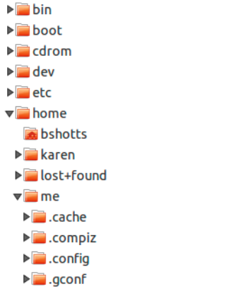

# 第 2 章 导航

除了如何在命令行中输入，我们还需要知道如何在 Linux 文件系统中导航。在这一章中我们将介绍以下几个命令：

* pwd - 打印当前所在的目录
* cd - 改变目录
* ls - 列出目录所包含的内容

## 理解文件系统树

和 Windows 一样，Linux 这种类 Unix 操作系统也是以一种叫做「分层目录结构」的方式来组织文件的。这意味着它们以树状目录结构（有时在其他系统中称为文件夹）进行组织，每一个目录中可能包含文件和其他目录。文件系统最外层的目录被称为「根目录」，根目录包含文件和子目录，子目录中又包含更多的文件和子目录，以此类推。

注意，与 Windows ——每一个存储设备都有一个独立的文件系统树——不同的是，Linux 这种类 Unix 操作系统通常只有一个文件系统树，不管有多少驱动或者存储设备连接到电脑上。根据系统管理员——负责系统维护的人员——的要求，存储设备连接（更准确的说法应该是「挂载」）到树上的各个位置。

## 当前工作目录

我们当中的许多人也许会对图 1 这种展示文件系统树的图形化的文件管理器比较熟悉。请注意，树通常显示为倒立，即根在顶部，而各个分支在下方。



然而，命令行无法显示图片，所以我们需要考虑一种不同的方式在文件系统中进行导航。

想象一下，文件系统是一个像倒立的树一样的迷宫，我们能够站在其中。在任意时刻，我们都只能位于一个目录中，我们可以查看这个目录包含的文件，也可以查看到我们上一层目录（我们称之为「父目录」）的路径，也可以查看我们下面的任何一个子目录。我们所处的目录称为「当前工作目录」。使用`pwd`（print working directory）命令可以展示当前工作目录。

```text
[me@linuxbox ~]$ pwd
/home/me
```

当我们登录进系统（或者打开一个终端模拟会话）时，当前工作目录是我们的「家目录」，每一个用户账号都有他自己的家目录，家目录是唯一一个允许普通用户写入文件的地方。

## 列出一个目录的内容

`ls`命令可以列出当前工作目录下的文件和目录。

```text
[me@linuxbox ~]$ ls
Desktop Documents Music Pictures Public Templates Videos
```

事实上，`ls`命令可以列出任何一个目录的内容，而不仅仅是当前工作目录，而且它还能做其他很多有趣的事。在后面的章节中，我们将花更多的时间探讨`ls`。

## 切换当前工作目录

`cd`命令可以切换当前工作目录（我们在树形迷宫中所处的位置）。为了做到这一点，我们需要在`cd`后面跟一个有效的「路径名」。路径名是我们沿着树的分支走到我们想要到达的目录的路线，有两种方式可以指定路径名：相对路径或者绝对路径。首先，让我们认识一下绝对路径。

### 绝对路径

绝对路径名从根目录开始，后面跟着一个又一个文件树的分支，直到到达期望的目录或文件为止。例如，在我们的系统中有一个目录，这个目录下安装了大部分系统程序，路径名是`/user/bin`。这个路径名的含义是，根目录（在路径名中用开头的斜杠表示）下有一个叫做「usr」的目录，这个目录下包含一个叫做「bin」的目录。

```text
[me@linuxbox ~]$ cd /usr/bin
[me@linuxbox bin]$ pwd
/usr/bin
[me@linuxbox bin]$ ls
……列出很多、很多很多内容……
```

可以看到，现在我们已经将当前工作目录改为了`/usr/bin`，并且这个目录充满了文件。注意到 shell 提示符是怎么变化了的吗？方便起见，提示符这里通常设置为展示当前工作目录的名字。

### 相对路径

与绝对路径——从根目录开始知道目标目录——不同的是，相对路径是从当前工作目录开始。为了做到这一点，相对路径使用一对特殊的符号表示文件系统树中的相对位置，这对特殊的符号是「.」（一个点）和「..」（两个点）。

「.」代表当前目录，「..」代表当前目录的父目录。下面让我们演示一下如何使用相对路径。让我们再次将工作目录切换到`/usr/bin`。

```text
[me@linuxbox ~]$ cd /usr/bin
[me@linuxbox bin]$ pwd
/usr/bin
```

现在假设我们想把工作目录切换到`/usr/bin`的上一层目录，也就是`/usr`。有两种方法可以达到这个目的，一种是使用绝对路径，

```text
[me@linuxbox bin]$ cd /usr
[me@linuxbox usr]$ pwd
/usr
```

另外一种是使用相对路径。

```text
[me@linuxbox bin]$ cd ..
[me@linuxbox usr]$ pwd
/usr
```

两种方式获得了相同的结果，那么我们应该用哪一种呢？当然是用需要敲击键盘次数最少的那个！

同样地，我们有两种方式可以将工作目录由`/usr`改为`/usr/bin`，一种是绝对路径，

```text
[me@linuxbox usr]$ cd /usr/bin
[me@linuxbox bin]$ pwd
/usr/bin
```

另外一种是相对路径：

```text
[me@linuxbox usr]$ cd ./bin
[me@linuxbox bin]$ pwd
/usr/bin
```

需要指出的很重要的一点是，在大多数情况下，我们可以忽略「./」，因为这是隐含的。输入：

```text
[me@linuxbox usr]$ cd bin
```

可以起到同样的效果。通常情况下，如果我们不指定路径名，默认就是当前的目录。

### 一些有用的便捷操作

表 2-1 列出了一些有用的、能够快速切换当前工作目录的方式。

| 便捷操作 | 效果 |
| :--- | :--- |
| cd | 将当前工作目录切换到你的家目录 |
| cd - | 将当前工作目录切换到上一个工作目录 |
| cd ~user\_name | 将当前工作目录切换到「user\_name」的家目录。例如：`cd ~bob`会将工作目录切换到用户「bob」的家目录 |

表2-1 cd快捷操作

> **关于文件名：**
>
> 在 Linux 系统上，文件的命名方式类似于 Windows 等其他系统，但是有一些重要的区别。
>
> 1. 文件名以「.」开头的文件会被隐藏。但这意味着用`ls`命令不会列出他们，除非你使用`ls -a`。当你的账号被创建的时候，一些隐藏文件被放到了你的家目录，用来为你的账号配置一些东西。在第 11 章中我们将进一步探讨如何利用这些文件自定义你的环境。除此之外，一些应用也将他们的配置文件作为隐藏文件放到了你的家目录下。
> 2. 和 Unix 一样，Linux 中的文件名和命令是大小写敏感的。比如，文件名「File1」和「file1」分别代表不同的两个文件。
> 3. 与其他一些操作系统不同的是，Linux 没有「文件扩展名」的概念，你可以随便给文件起一个你喜欢的名字。一个文件的内容和（或）作用是用其他方式确定的。虽然累 Unix 操作系统不用文件扩展名来决定文件的内容（或作用），但是许多应用程序会这么做。
> 4. 尽管 Linux 支持长文件名，其中可能包含嵌入的空格和标点符号，但是将你创建的文件名中的标点符号最好只包含句点，破折号和下划线。更重要的是，不要在文件名中包含空格。如果你想在文件名中表示两个单词之间的空格，请使用下划线，当你这么做了，在不久的将来你就会感谢你自己的。

## 总结

本章解释了 shell 如何对待系统的目录结构。我们了解了绝对路径和相对路径，以及基本的、用于在这个结构中移动的命令。下一章我们将利用本章学习的知识开启在现代 Linux 系统中的旅程。

